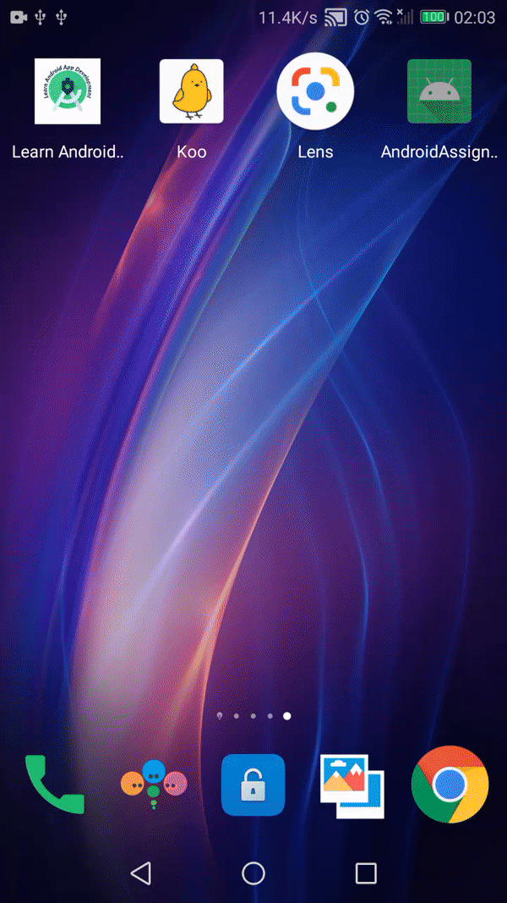

<h1 align="center">NoBroker Assignment</h1>

  

  
This is an android demo project based on modern Android application tech-stacks and MVVM architecture. The app get data from Remote server and also caching data the in Room Database.

<table>
  <tr>
    <td></td>
 
  </tr>

 
 </table>

## Libraries & Tech Used
- Minimum SDK level 23
- [Kotlin](https://kotlinlang.org/) based, [Coroutines](https://github.com/Kotlin/kotlinx.coroutines) for asynchronous handling.
- [Hilt](https://dagger.dev/hilt/) for dependency injection.
- JetPack
  - LiveData - notify domain layer data to views.
  - Lifecycle - observing data when lifecycle state changes.
  - ViewModel - lifecycle aware UI related data holder.
  - [Room Database](https://developer.android.com/training/data-storage/room) - for data caching
- Architecture
  - MVVM Architecture (View - ViewModel) 
- [Glide](https://github.com/bumptech/glide) - loading images.
- [Navigation Component](https://developer.android.com/jetpack/androidx/releases/navigation) for navigation between view.
- [Retrofit](https://square.github.io/retrofit/) for Api Calling
- Shimmer-Effect
